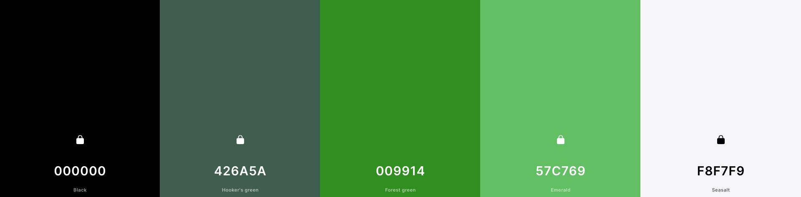

# F21DV coursework : Carbon footprint of food production

This visualisation features 3 visualisations about CO2 emmissions of food production all over the world :

1. Globe animated choropleth with a lollipop chart
2. sunburst

## Kaggle resource links:

https://www.kaggle.com/datasets/yoannboyere/co2-ghg-emissionsdata?resource=download
https://www.kaggle.com/datasets/selfvivek/environment-impact-of-food-production
https://www.kaggle.com/datasets/dorbicycle/world-foodfeed-production?datasetId=4787&sortBy=voteCount

## Color palette :

## Demo :

[Link](https://www.youtube.com/watch?v=z9M5PJfGuBM)
